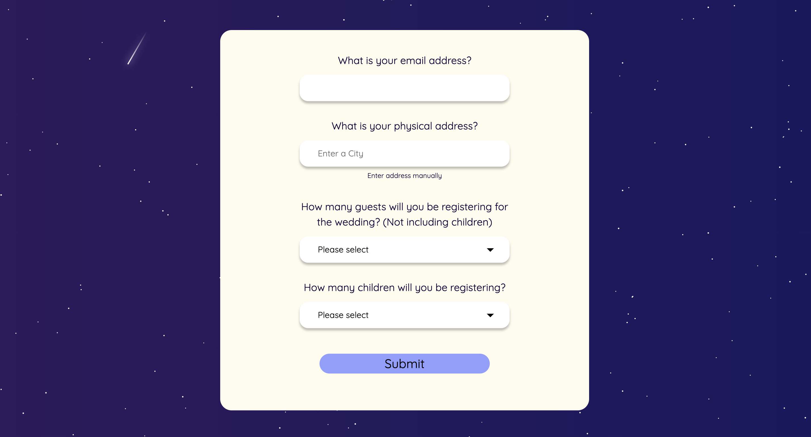
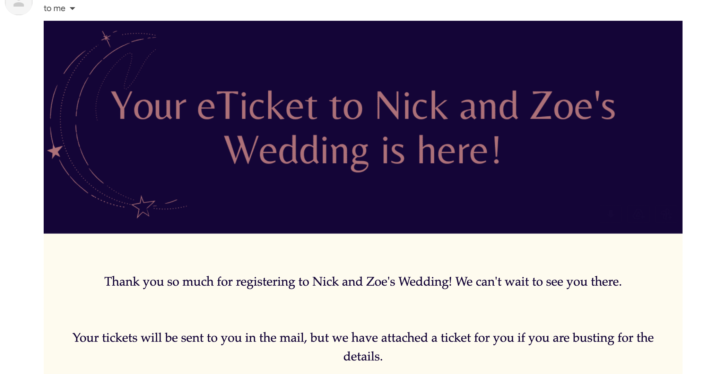

# Wedding Guest Sign Up Website

This is a website intended for guests to register to the wedding/event prior to receiving an invitation. 

Note that this is not an RSVP website, as the guest must register for a ticket prior to receiving an invitation. It is intended to force registration instead of hoping for an RSVP. 

Once registered, the guest will receive an e-Invite (and later, a physical invitation). 

## Basic Architecture

This website is deployed via Google App Engine. The frontend and backend are containerised into seperate Apps and deployed using `app.yaml` files. Before deployment, environment variable such as salts for hashing authentication are required.

The frontend is built using React. The backend is using ExpressJS. 

There is a password on the front page that is hashed and passed to backend to authenticate. 

The form is sent via API call to the backend to store into a database, and also triggers an email to send to the user with an attached eInvite. 

The frontend then directs to a confirmation page when successful. 

## Running locally 

You will need a Secret in Googles Secret Manager, a GCP credentials file and path and a firestore database. You can build the docker images with `auto/build` and run the frontend and backend with `auto/run`. Some of the enviroment variables are bulled into the container, as defined by the docker compose file. 
